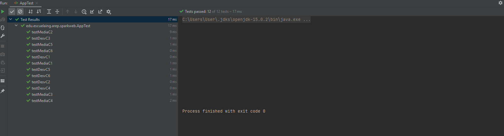
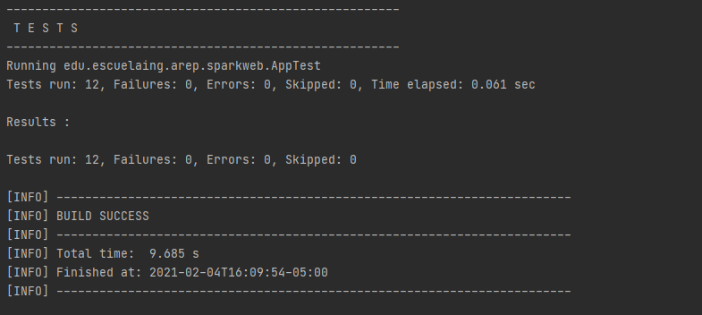
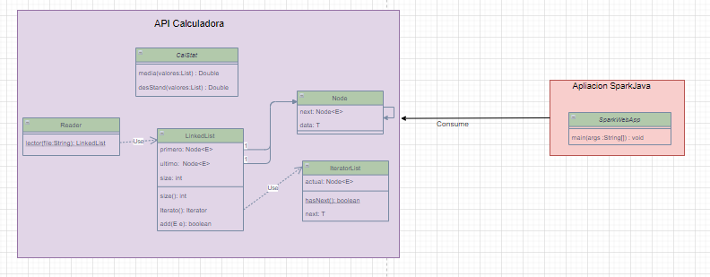

# Mi primer proyecto con Heroku y Spark

### Autor: Juan Sebastian Ramos Isaza

### Fecha: 04/02/2021

### Despliegue Heroku

### Circleci

### Prerequisitos
Para la ejecución de la aplicación de manera local se necesitan los siguientes componentes:
* java 8 o superior
* maven
* git 

### Instalacion
1. Se debe clonar el proyecto desde el Shell de su máquina con el comando :
    * git clone https://github.com/jsr25/Taller2Arep.git
2. Moverse a la carpeta que se acaba de clonar:
    * cd Taller2Arep
3. Se debe ejecutar un comando de Maven para comprobar el funcionamiento:
    * mvn package

### Pruebas
Se ejecutaron varias pruebas para probar el funcionamiento tanto del cálculo de la media como de la
desviación estándar, se realizaron con varios archivos que se leyeron

A continuación se puede observar la ejecución de las pruebas por medio de Maven

### Arquitectura General
Se puede ver la arquitectura que se usa para la implementación de este servicio web,
podemos ver la API de una calculadora y una aplicación de Spark que la consume para prestar
un servicio.

### Ejecucion
* Maquinas con distribuciones de linux:
> java -cp target/classes:target/dependency/* edu.escuelaing.arep.sparkweb.SparkWebApp
* Maquina con windows
>java -cp target/classes;target/dependency/* edu.escuelaing.arep.sparkweb.SparkWebApp

Deben ejecutar esto en directorio del proyecto.
### Javadoc
La documentación se encuentra en el directorio apidocs, para generar una nueva documentación
pueden hacer uso del comando mvn javadoc:javadoc en su Shell esta se generará en el directorio target/site.

### Licencia

En este proyecto se usó la licencia GNU - se puede ver [LICENSE.txt](LICENSE.txt) para más detalles.

